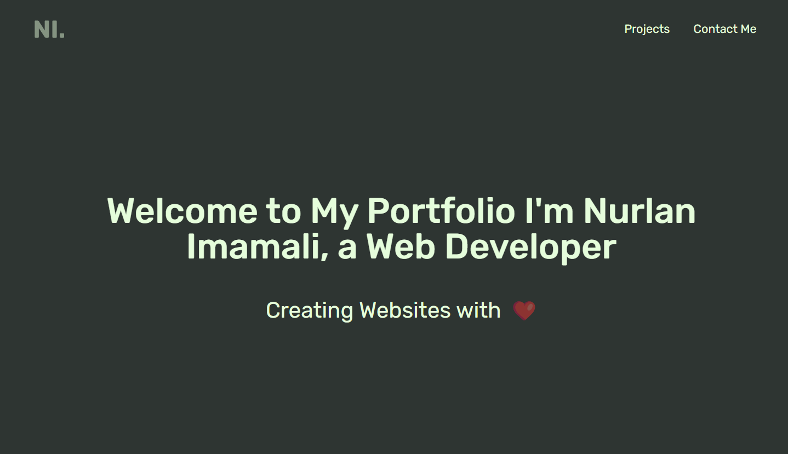

# My Portfolio Website

Welcome to my portfolio website! This project showcases my skills, projects, and experience using React, Tailwind CSS, Framer Motion, and email.js.

## Demo

You can access the live demo of this website [here](https://www.nurlanimamali.tech).

## Features

- **Responsive Design:** The website is fully responsive, ensuring a seamless experience across various devices.
- **Animated Transitions:** Implemented using Framer Motion for smooth and engaging page transitions.
- **Contact Form:** Utilizes email.js to enable users to contact me directly through the website.
- **Project Showcase:** Displays my projects, skills, and experience in an organized and visually appealing manner.

## Technologies Used

- **React:** Used for building the frontend and managing the components.
- **Tailwind CSS:** Employed for styling and creating a sleek, modern UI.
- **Framer Motion:** Implemented for creating engaging animations and transitions.
- **email.js:** Integrated for handling the contact form submissions.

## Contact

For any inquiries or feedback, you can reach me at nurlanimamali@gmail.com.